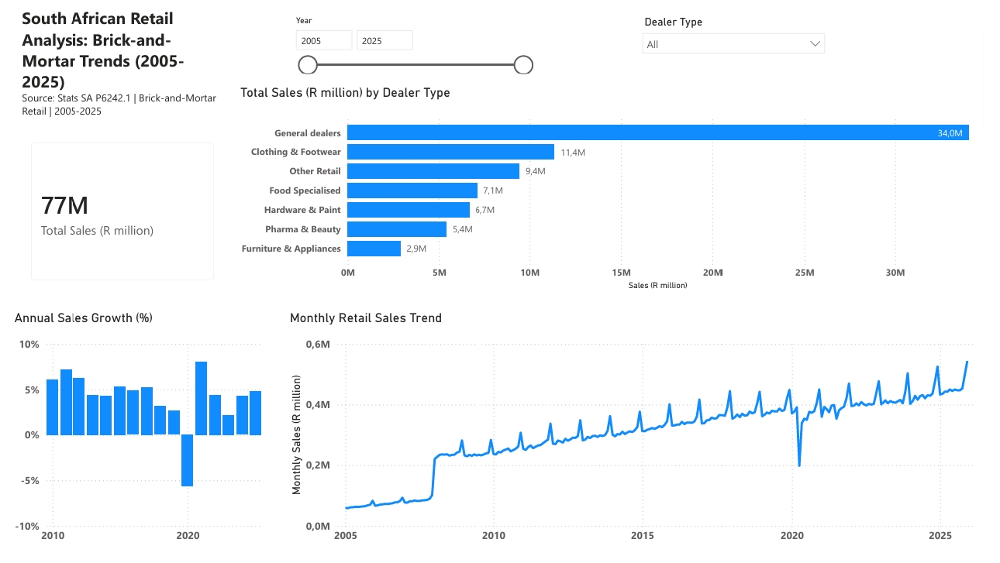

# South African Retail Analysis: Brick-and-Mortar Trends (2005-2025)

Interactive Power BI dashboard analysing South African brick-and-mortar retail trends (2005-2025) from Stats SA P6242.1.

## 🔍 Project Overview
This business intelligence dashboard analyzes historical brick-and-mortar retail performance trends across South Africa spanning from 2005 to 2025. The goal of this project is to track high-level macroeconomic performance, uncover seasonal sales anomalies, and compare market share distributions across different dealer types.

## 📊 Dashboard Overview

[📄Download PDF](files/dashboard.pdf) | [⬇️Download PBIX](files/SA_Business_Performance_Dashboard.pbix)

This project analyses brick-and-mortar retail trade to uncover trends, seasonality, and performance across dealer types.

**Visuals:**
- *Total Sales (77M) KPI* - Total brick-and-mortar sales (R million) | Filter: Excluded 2026 (incomplete year)
- *Total Sales by Dealer Type* - General dealers (34.0M) dominate, followed by Clothing & Footwear | Filter: Excluded 2026
- *Annual Sales Growth (%)* - YoY growth 2010-2025 showing COVID -6% drop in 2020 | Filters: Excluded 2005-2009 (early data inconsistent for YoY calculation) + 2026
- *Monthly Retail Sales Trend* - Monthly sales 2005-2025 with December seasonality | Filter: Excluded 2026

## 🛠️ Tools
- Power BI Desktop, DAX, Power Query

## 🧹 Data Preparation
- Source: Stats SA P6242.1 (2005-2025)
- Cleaned dealer names, created Date table
- DAX: Total Sales (R million), YoY Growth %
- Page-level filter: Exclude 2026 (incomplete). Visual-level filter on Annual Growth to exclude 2005-2009 to ensure accurate YoY calculation.

### 1. Data Transformation (Power Query)
* *Data Cleaning:* Structured raw Stats SA P6242.1 retail datasets by fixing data types, removing trailing null headers, and resolving date alignment anomalies.
* *Date Dimension:* Modeled a customized, contiguous Calendar Table to power complex time-intelligence analytics.

### 2. Analytical Calculations (DAX Metrics)
Engineered key performance metrics to benchmark category growth. Key measures include:
* *Total Sales Value:* Accumulates volume performance across all dealer categories.
* *Annual Sales Growth (%):* Year-over-year calculation measuring macro shifts across financial periods.

## 💡 Key Insights
- General dealers = 34M of 77M (~44% share) - largest category in SA retail.
- Steady 2-7% growth 2010-2019, -6% crash in 2020 (COVID lockdowns), recovery from 2021.
- Strong December seasonality every year.

## 📂 Files
- SA_Business_Performance_Dashboard.pbix - Power BI file
- dashboard.pdf - PDF
- dashboard.png - Screenshot

## 📚 Data Source
Statistics South Africa - Retail Trade Sales P6242.1

## 👤 Author
*Celokuhle Sandise Ntete* - Data & Quantitative Analyst
